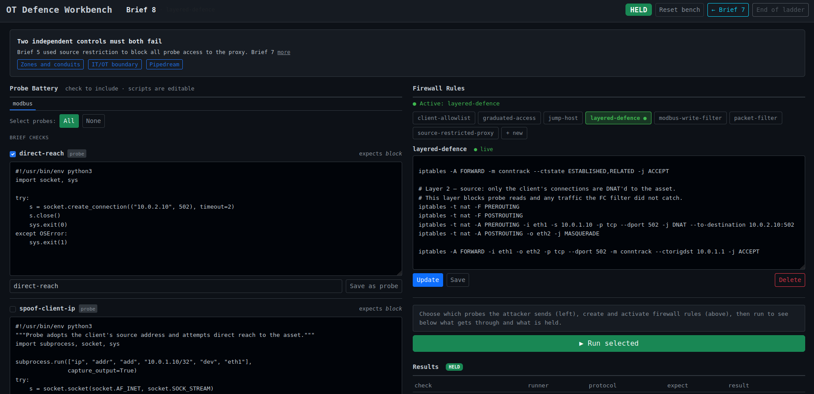

# OT Defence Workbench



A containerlab environment for practising OT network defence. Four containers, two
segments, one asset to protect, one adversary that probes. Each brief states what
outcome must hold; the workbench tells you whether it does.

## What it is not

A green scoreboard means the probe found no path through. It does not mean secure. The probe battery is finite, the
asset is a simulation, and the workbench teaches the shape of a decision rather than the specifics of any particular
vendor's appliance. That distinction is worth carrying from the start.

## The estate

```
north segment 10.0.1.0/24          south segment 10.0.2.0/24
  client  10.0.1.10                   asset  10.0.2.10:502  (Modbus/TCP)
  probe   10.0.1.20                          10.0.2.10:802  (Modbus/TLS)
                                             10.0.2.10:1883 (MQTT)
                                             10.0.2.10:2404 (IEC 104)
                                             10.0.2.10:4840 (OPC-UA)
                                             EtherType 0x88B8 (GOOSE)
                    boundary  north 10.0.1.1 / south 10.0.2.1
```

- client: the legitimate consumer of the asset.
- asset: a Modbus/TCP server (port 502) and an MQTT broker (port 1883) and an OPC-UA server (port 4840). Holds a
  register map the client reads and writes; serves telemetry and command topics
  over MQTT.
- boundary: the node the learner builds out. Starts as a transparent bridge.
- probe: the adversary. Sits on the north segment alongside the client and runs a
  battery of attempts against the asset.

The asset is only reachable through the boundary. Nothing on the north segment has a
direct route to the south segment.

## Running it

Prerequisites: Docker, [containerlab](https://containerlab.dev/install/), Python 3.11+.

```
python3 -m venv .venv
.venv/bin/pip install -r requirements.txt
./lab up
python web/app.py
```

Open `http://localhost:5000`.

When a brief requires a new container image (a new check script is added to
`probe/checks/` or `client/checks/`), restart the lab:

```
./lab down && ./lab up
```

Only needed when adding new material.

After a restart, re-activate any component that was active before. Container
filesystems are wiped on restart; state written by `asset.sh` (such as brief 14's
SA mode flag) does not survive. The boundary's iptables rules are also reset.
Clicking Activate in the UI re-runs both `apply.sh` and `asset.sh` on the fresh
containers.

## The web UI

The web interface is the working surface. It has three sections.

Probe Battery: the checks the probe and client will run. Brief checks come from
the active brief's TOML file and show the source script. Custom probes can be written
and saved directly in the browser under any supported protocol tab.

Firewall Rules: the components available on the boundary. Select one to view or
edit its `apply.sh`, then activate it. Only one component is active at a time.
Activating a new one flushes the previous. The Save button saves changes to disk
without activating.

Results: the outcome of the last run. Each check shows whether the result matched
the brief's expectation. The headline HELD or OPEN reflects whether all brief checks
passed their expected outcomes. Custom probe results are shown separately and do not
affect the headline.

Use Next brief and Prev brief to move through the ladder. Navigation resets the
boundary rules and clears results.

## The briefs

The briefs form a ladder. Each introduces new conditions and/or attack vectors and asks for a defence that holds.

| #  | Slug                    | Teaches                                                                                                         |
|----|-------------------------|-----------------------------------------------------------------------------------------------------------------|
| 1  | block-probe             | Basic network segmentation: FORWARD DROP with a permit for the client.                                          |
| 2  | write-one-setpoint      | Source allowlisting: permit by IP, introducing the assumption that breaks in brief 4.                           |
| 3  | jump-host               | Topology control: close the direct path, proxy all connections through the boundary via DNAT.                   |
| 4  | spoof-proof             | IP spoofing: the jump-host holds because it does not inspect source addresses.                                  |
| 5  | source-restricted-proxy | Tighten the proxy: restrict the DNAT rule to the authorised source so the probe cannot use the proxy at all.    |
| 6  | modbus-write-filter     | Protocol-layer enforcement: iptables u32 drops write function codes regardless of source.                       |
| 7  | graduated-access        | Graduated access: reads open to all, writes gated to the authorised host.                                       |
| 8  | layered-defence         | Defence in depth: source restriction and function code filter are independent; both must fail simultaneously.   |
| 9  | modbus-tls              | Upgrade the transport: block plain port 502, serve Modbus/TLS on 802; client connects with TLS.                 |
| 10 | mqtt-block-probe        | Protocol breadth: same segmentation principle applied to MQTT; no auth, wildcard subscribe, command publish.    |
| 11 | mqtt-auth               | Application-layer auth: boundary transparent, mosquitto rejects anonymous CONNECT with rc=5.                    |
| 12 | iec104-block-probe      | Ukraine 2015/2016: block IEC 104 (port 2404) from the probe; C_SC_NA_1 trip command as the adversary payload.   |
| 13 | iec104-command-filter   | Protocol-layer enforcement: u32 rejects C_SC_NA_1 (0x2D) on the ASDU type byte; connect and STARTDT pass.       |
| 14 | iec104-sa               | Application-layer auth: IEC 62351-5 SA on the asset rejects unauthenticated commands; boundary is transparent.  |
| 15 | goose-block-probe       | Layer 2 enforcement: GOOSE trip blocked at the relay by source MAC; iptables cannot see it.                     |
| 16 | goose-trip-filter       | Content filter: relay parses allData BER field and drops BOOLEAN TRUE (trip); cancel frames pass.               |
| 17 | goose-sa                | Application-layer auth: IEC 62351-6 SA on the asset; unsigned GOOSE frames dropped, no echo.                    |
| 18 | opcua-port-block        | Protocol breadth: same port-block principle applied to OPC-UA (port 4840); client reads process data.           |
| 19 | opcua-auth              | Application-layer auth: boundary transparent, OPC-UA server rejects anonymous sessions (BadUserAccessDenied).   |
| 20 | opcua-sec-policy        | Security policy negotiation: server requires Basic256Sha256_Sign; None-policy probe rejected at handshake.      |
| 21 | rate-limit              | Volumetric protection: per-source-IP token bucket throttles rapid connections; client's separate bucket intact. |

## The components

Each component lives in `components/<name>/apply.sh`. Activating a component copies
the script to the boundary container and executes it. Components may also include
`asset.sh` to configure the asset container directly (used by briefs 11, 14, 19, and 20). `remove.sh`
and `asset-remove.sh` are called when the component is flushed.

| Component                 | What it does                                                                             |
|---------------------------|------------------------------------------------------------------------------------------|
| `packet-filter`           | FORWARD DROP with commented permit rules to fill in.                                     |
| `client-allowlist`        | Permits the client's IP through, drops everything else.                                  |
| `jump-host`               | DNAT proxy: redirects port 502 to the asset, no source restriction.                      |
| `source-restricted-proxy` | DNAT proxy restricted to the client's source address.                                    |
| `modbus-write-filter`     | Jump-host base with u32 rules blocking all Modbus write FCs.                             |
| `graduated-access`        | Open DNAT proxy with write FCs blocked for all sources except the client.                |
| `layered-defence`         | Source-restricted DNAT combined with write FC filter as a second independent layer.      |
| `modbus-tls`              | Blocks port 502 from all; allows port 802 (Modbus/TLS) from client only.                 |
| `mqtt-port-filter`        | Blocks port 1883 from the probe; permits MQTT from the client only.                      |
| `mqtt-auth`               | Transparent boundary + mosquitto password auth; anonymous connects rejected.             |
| `goose-trip-filter`       | Relay drops GOOSE frames with allData BOOLEAN TRUE (trip); cancel frames pass.           |
| `goose-sa-asset`          | Transparent boundary + IEC 62351-6 SA on asset; unsigned GOOSE frames rejected.          |
| `iec104-port-filter`      | Blocks port 2404 from the probe; permits IEC 104 from the client only.                   |
| `iec104-command-filter`   | Rejects IEC 104 C_SC_NA_1 (type 0x2D) via u32; connect and STARTDT pass.                 |
| `iec104-sa-asset`         | Transparent boundary + IEC 62351-5 SA on the asset; unauthenticated commands rejected.   |
| `goose-block-probe`       | Adds probe MAC to the boundary's GOOSE relay block list; client GOOSE passes.            |
| `opcua-port-filter`       | Blocks port 4840 from the probe; permits OPC-UA from the client only.                    |
| `opcua-auth-asset`        | Transparent boundary + OPC-UA server requires credentials; anonymous sessions rejected.  |
| `opcua-sec-policy`        | Transparent boundary + OPC-UA server requires Basic256Sha256_Sign; None policy rejected. |
| `rate-limit`              | Per-source-IP hashlimit (3/min, burst 3); probe exhausts its bucket, client unaffected.  |


## Customisation

Custom probes and custom filters let you work outside the fixed brief ladder.
Write a probe to test a hypothesis, write a filter to try a rule, run them
against each other to see what holds.

**Custom probes.** Write a script in the New probe section, assign it a protocol
and name, save. It appears in the protocol tab alongside brief checks and runs
inside the probe container when selected. Results appear in the CUSTOM PROBES
section of the results table and do not affect the HELD/OPEN headline. Saved
probes live in `probe/custom/<protocol>/<name>.py`; the template at
`probe/custom/_template.py` is the starting point. No lab restart needed.

**Custom filters.** Write a filter script in the Firewall Rules editor, give it
a name, save or activate it directly. Saved components appear alongside the
built-in ones; activating one pushes its `apply.sh` to the boundary container.
Saved components live in `components/<name>/apply.sh`. The address comment at
the top of any built-in `apply.sh` is a reference for IP assignments.

For anything beyond iptables rules on the boundary, new check scripts, new
protocols, new asset behaviour, see [README-tech.md](README-tech.md).

## Notes

The [blue documentation](https://blue.tymyrddin.dev/docs/ot/) covers the per-protocol security recipes and the 
architecture patterns. The workbench makes those decisions executable: each brief links to a relevant doc page, and 
each component is the iptables translation of a pattern described there.

The workbench is prevention-focused. No brief asks the boundary to hold the line while also generating
evidence. Detection and alerting are a different class of tool. The HELD/OPEN verdict records whether
traffic passed; what was logged is not measured.
